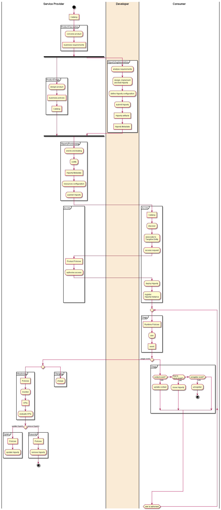

## Hyperty Life-cycle

<!--
@startuml "hyperty-life-cycle.png"

|Service Provider|
start
:Catalog]

partition ProductConception {
    :conceive product;
    :business requirements]
}
    fork
partition ProductDesign {
	    :design product;
	    :business policies]
	    :Catalog]
}
	fork again

|#AntiqueWhite|Developer|
partition Design {
	:analyse requirements;
    :design Hyperty;
    :design tests;
    :Design Metadata]
}

partition Implement {
    :implement Hyperty;
    :define Hyperty configuration;
    :Hyperty artifacts]
}

partition Test {
    :test Hyperty;
    :submit Hyperty;
}

|Service Provider|
    end fork
partition Provisioning {
	:end-to-end testing;
	:certify;
	:Hyperty Metadata]
	:resources configuration;
	:activate;
	:publish Hyperty;
	}

|#LightRed|Consumer|
partition Discover {
	:Catalog]
	:discover;
	}

partition Access {
	:access request;

	|Service Provider|
	:Product Policies]
	:authorise access;
	|Consumer|
	:deploy Hyperty;
	:associate to\nTangible Entity;
	}

partition Usage {
	:register Hyperty Instance;
	:use;
	:unregister Hyperty;
	:usage event]
}

|Service Provider|

while (active?)

partition Monitor {
	:Policies]
	:monitor;
	:KPIs]
}

if (remove service) then (yes)
partition Removal {
	:Policies]
	:remove Hyperty;
}

stop

elseif (update service?) then (yes)
partition Update {
	:Policies]
	:update Hyperty;
	detach
}

endif

endwhile

stop

@enduml
-->

