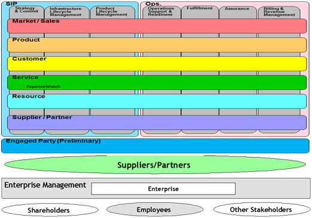

### TM Forum Business Process Framework (eTOM)

The TM Forum eTOM standard provides common definitions to describe business activities to be performed by service providers including basic information required to perform each process element within a business activity. eTOM has been widely adopted by the Telecommunication industry with many versions published. Version 14 was published May 2014.

The Business Process Framework model consists of processes at 5 levels and these levels form a hierarchy, with each level encapsulating a group of processes at the next level of detail. The graphic representation of an Business Process Framework (eTOM) model consists of rows and columns, the intersections of which denote specific business processes (see Level0 eTOM processes, below). In this manner the Business Process Framework map covers the whole value chain. 

 
 
The three basic process areas are:
* The Operations Process Area includes all operations processes that support the customer (and network) operations and management, as well as those that enable direct customer operations with the customer. 
* The Strategy, Infrastructure & Product Process Area includes processes that develop strategies and commitment to them within the enterprise; that plan, develop and manage the delivery and enhancement of infrastructures and products; and that develop and manage the Supply Chain.
* The Enterprise Management Process Area focus on both the setting and achieving of strategic corporate goals and objectives, as well as providing those support services that are required throughout an Enterprise. These processes are sometimes considered to be the corporate functions and/or processes. e.g., Financial Management, Human Resources Management processes, etc… 

The four functional process blocks are:
o	The Market and sales domain , Product and Customer include processes dealing with sales and channel management, marketing management, 
*	The Product Domains includes processes such as managing product offering.
*	The Customer domain manages the customer interface, customer relationship, customer problem handling, billing processes and all type of operational customer processes
*	The Service processes include those dealing with service development and delivery of service capability, service configuration, service problem management, quality analysis, and rating.
*	The Resource processes include those dealing with development and delivery of resource (network and IT) infrastructure, and its operational management including aspects such as provisioning, trouble management and performance management. Resource infrastructure supports products and services, as well as supporting the enterprise itself.
*	The Supplier/Partner processes include those dealing with the enterprise’s interaction with its suppliers and partners. This involves both processes that develop and manage the Supply Chain that underpins product and infrastructure, as well as those that support the operational interface with its suppliers and partners.

