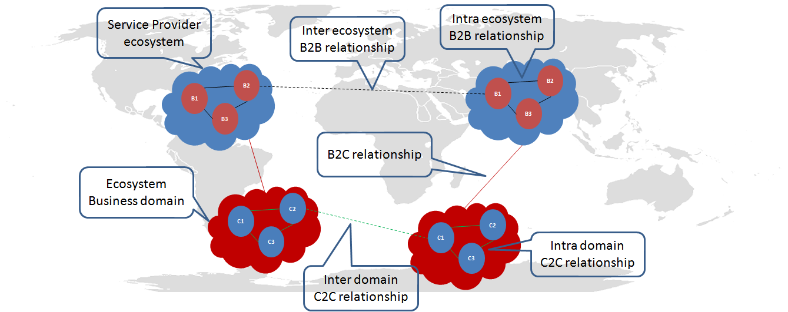
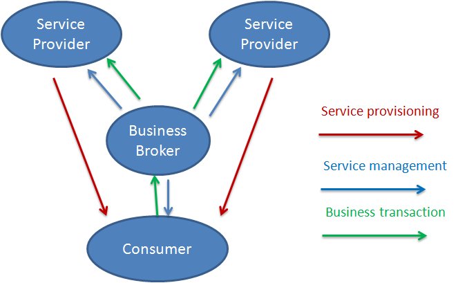
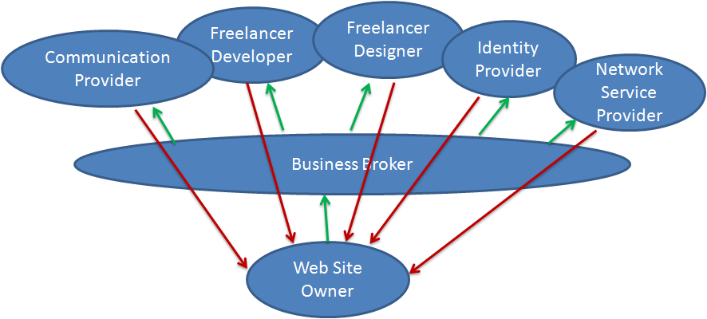

### Business Models

#### References

http://digitalenterprise.org/models/models.html

##### Two sided Business Models
Denise is discribing that right now. I update very soon.

http://www.stlpartners.com/manifesto.php

##### Collaborative Ecosystems

Ecosystem economics describe how the core product (e.g., iDevices or Google ads) becomes more and more valuable, as the
numbers of partners, notably developers, grow. The ecosystem network effect between developers and users drives the explosive growth of the core product. Lock-in creates natural “walled gardens,” as users develop habits around apps, while developers are locked-in by high switching costs created by their investments into the core product. On the other hand, Developers must be viewed as partners and reselhers, not as a source of direct profit, that will push the core product, to new users, new usage models and new market niches. 

Service Provider APIs are key technology enablers to get developers as partners in the ecosystem and APIs business models  need to be aligned with developers business models. APIs openness promotes lower barriers to entry and the acquisition of a large range of complementary products (e.g. apps, hardware accessories). However, core products are closed (integrated) around core businesses to deliver unique value, elevate barriers to entry and achieve sustained profitability. 

http://www.visionmobile.com/product/telco-innovation-toolbox-report/

##### Asymmetric Business Models

According to VisionMobile research, Asymmetric business models are based on providing Products to different Markets in a way that promote the migration of profits from one market to another, breaking barriers between Industry barriers to get competitive advantage. The decision to compete in multiple markets should be driven by customer experience improvement, rather than about the efficiency of the company operations, by leveraging systems integration across industries. Customer traction in one market also boosts the demand in the other market. For example, smartphones get more attractive depending on how many apps and services are available on them. These markets are called Complementary Markets.
The mechanics of Asymmetric business models is based on promoting very high demand on complementary markets (e.g. by making products radically cheaper or more accessible for customers) and bundling Service Provider Core product with this new demand. The source of such demand should be difficult to replicate and to be bought by competitors. Then, Service Bundles should be created in a way that promotes the transfer of profits to Service Provider core business. Low (or zero) marginal cost of many modern technology products enables asymmetric business models to be self-sustained. 

Examples on how these models are applied by leading digital service providers are:

1. Apple competes in both consumer electronics and digital content markets, making consumer electronics more attractive.
2. Google that compete in both online advertising and mobile markets, leverages the integration of user data mining on Android with its advertising network to make Google PC ads more attractive for advertisers.
3. Amazon that compete in both e-commerce and tablet markets, takes advantage of its ability to present its services to tablet users to make online shopping easier and more spontaneous.

New generation of Messaging Service providers like WeChat, Viber, Line and others are also using asymmetric business models, by providing for free SMS competitor messaging services that is monetised with e-commerce services to sell digital goods, physical goods and services.

http://www.visionmobile.com/product/asymmetric-business-models/
http://www.visionmobile.com/product/telco-innovation-toolbox-report/

### Market Model

Over the last decade over the top services (OTT), such as instant messaging (IM) and Voice over IP (VoIP), have revolutionized the well-established services and business models of telecommunication providers. However, applied communication standards and protocols are mainly used to create closed ecosystems, resulting in a highly fragmented market of mostly isolated communication platforms that restrict free, open and interoperable communication flows. 
Currently, telecommunication architectures are based either on the Telco federation or on a global “Private Walled garden” distribution models (Figure 1):
•	Telco Federated distribution model: universal interoperability and a highly regulated market constrain service delivery agility to geographically limited markets. However, this model ensures consumers well defined expectations in terms of reachability among users (independently of its service provider domain), trust in service providers and service quality. 
•	“Private Walled Garden” distribution model: used by popular players like Google, Skype and WhatsApp (aka Over The Top - OTT) that have much more agility to deliver cost-effective (mostly free) innovative services to borderless markets. However, OTT players are creating silos of users where only intra-domain interoperability is ensured (for example, a WhatsApp user can only send a message to another WhatsApp user, a Skype user can only call to another Skype user or use Skype’s breakout service to the PSTN). In this model, service developers and third-party service providers are forced to use proprietary APIs and incur difficulties if they attempt to sell and distribute services to different domains and are limited to the user base of the service provider. In general, services are developed within a specific service domain, constraining service reachability between different service domains. Trust in service providers is more and more questionable and becomes a concern; the service delivery is unregulated and has to rely on best-effort Internet connectivity in all cases.

The reTHINK Market Model leverage the best from these two models to create a trusted worldwide cooperative service delivery model where different service provider ecosystems are dynamically created to better meet consumer needs. In the light of the new age of digitalization and peer to peer communication, future communication service solutions are required to address service scenarios not only between human entities but all possible variations between human and non-human entities. The reTHINK Market Model is conceived based on the concept that there is a need for an open and standardized enabling architecture for digital communication based on modern web technologies between devices, services, sensors and humans that incorporates reliable authentication and identity management for establishing trusted communications and managed quality of service (QoS) for reliable and efficient service delivery. The reTHINK Market Model introduces a Hyperlinked Entity (Hyperty) concept as a reliable and secure service enabler to interconnect devices, sensors, services and humans. In this model, service providers can deliver services to any domain with minimum costs and consumers can use them with no security or privacy concerns. The reTHINK Market Model will power both creative individuals (e.g., featuring personal devices) and large corporations (e.g., operating powerful data centers) to easily setup and deliver innovative services to the global market. IP connectivity network services specialized for real-time communications are offered to service providers in order to remove the limitations of best-effort Internet connectivity.

#### Brokerage Business Model

A Business Broker facilitates and promotes the best match between Service Consumers and Service Providers, orchestrating service delivery flows among them. In addition it also mediates business transactions between involved stakeholders.
The Business Broker should ensure it has access to a large consumer base in order to atract service providers. The main Business Flows are (see picture below):
- Service Providers publishes their offers towards the Business Broker
- Consumer searches for services or is notified by business broker about services that match consumer needs
- service delivery is managed by Business Broker but the main service delivery flow can be a direct flow between Service Provider and service consumer
- payments for service delivery are mediated by the Business Broker

Note: it should also be possible to have service / App providers having access to niche markets to trigger the service deliver through the collaborative service delivery ecosystem. FFS

A Brokerage Business Model example:

